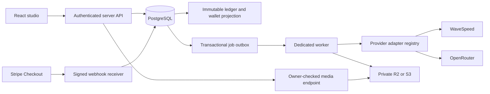

# Model Drops architecture

## Two deliberately separate environments

The working product preview runs a Next-compatible React/TypeScript app through Vinext on Cloudflare Workers, with Drizzle migrations, D1 records, R2 private media, and authenticated Sites identity. It is useful for product review and does not call billable providers.

The production foundation targets PostgreSQL and a dedicated Node worker. The Postgres outbox replaces an initial Redis/BullMQ dependency: enqueue and financial reservation commit in one database transaction, and workers lease jobs using `FOR UPDATE SKIP LOCKED`. Redis can be introduced for caching and dispatch without becoming the authoritative financial store. The production services are not wired into the demo endpoints.

## Credit and generation invariants

1. The server selects the current model, pricing version, supported input schema, and compatible approved character version. It verifies active purchase, license, moderation status, and real-person consent review.
2. A wallet row lock serializes reservations. A user-scoped idempotency key and request hash distinguish a retry from a different request.
3. A generation record, immutable negative credit entry, and durable job commit together. The wallet is a projection, not the sole source of truth.
4. The worker marks a job as submitting before the external side effect. It does not automatically resubmit an ambiguous provider request. Expired submitting leases enter reconciliation.
5. Known asynchronous predictions are polled by ID. Provider URLs are never shown directly to clients. Media is copied to platform-owned storage before completion.
6. A terminal provider failure creates one compensating refund, guarded by a unique idempotency key. Completion and settlement lock generation state. A completed generation is not refunded by a late cancellation.
7. Wallet projection reconciliation is exposed as a PostgreSQL view. Seller transactions, audit records, license versions, and financial entries are append-only.

The demo uses a shorter D1 outbox with an asynchronous `waitUntil` processor and an authenticated recovery endpoint. It demonstrates behavior without claiming that a `waitUntil` task is a substitute for a long-running production worker.

## Provider boundaries

The `AIProvider` contract separates image, video, text, status, cancellation, cost calculation, and normalization. Only verified supported capabilities are implemented. WaveSpeed cancellation is explicitly unsupported; deleting a prediction is not assumed to stop billing. The OpenRouter adapter supports its dedicated image API and text chat endpoint, with image MIME restrictions. Video can use the WaveSpeed adapter with an approved model binding.

Private character storage keys, trigger information, training assets, and provider parameters stay in server-only tables. Character implementation types remain extensible. Customer-facing DTOs must whitelist name, preview, public capabilities, license summary, and credit price; they must not serialize whole model or character-version records.

Provider model IDs and parameters come from the reviewed model registry. Launch requires end-to-end validation of every advertised model and character implementation, including actual character consistency, storage URL signing, duration, FPS, and output limitations. No real model has been advertised as connected in the preview.

## Payments and marketplace

Credit checkout creates an internal immutable price/credit snapshot and a server-created Stripe session. Only a verified raw-body webhook can credit the wallet. The handler validates live/test environment, settled payment status, amount, currency, session ID, and the internal payment reference. Different success event IDs cannot double-credit an already paid internal payment.

Marketplace purchases require a separate fulfillment service that snapshots buyer, seller, license text/version/permissions, price, tax, and revenue rules. `splitMarketplaceSale` provides integer-cent fee/reserve calculations. Stripe Connect onboarding, transfer execution, refunds, disputes, reserve release, negative seller balances, jurisdiction-specific tax handling, and payout reconciliation remain launch work. Do not enable them merely by adding API keys.

Usage royalties are represented as versioned opt-in marketplace rules and are disabled by default. There is no fixed compulsory per-generation royalty in the schema.

## Authentication and authorization

The private preview trusts Sites authentication headers only behind the Sites dispatcher. Local mock authentication is limited to loopback development. Do not put the development origin on the internet.

The production application must supply a verified user ID to service functions. Email/password, verified email, OAuth linking, recovery, MFA, device management, and session revocation require an actual authentication provider integration. Production database roles should grant financial writes only through controlled services and the credit posting function. Migration and application credentials must be distinct.

All private media reads check ownership. References use opaque IDs, bounded size, image signature checks, private storage, and ownership validation. Production uploads additionally need quarantine, malware/content checks, safe decoding, and retention controls.

## Model operations and moderation

The demo supports administrative price/availability updates and concept approval/rejection; approval never publishes a paid listing. PostgreSQL supports a broader versioned model registry and moderation cases. A full schema-driven admin editor, model registration UI, creator asset ingestion, content classifier integration, trained identity/consent review, appeals, IP complaint evidence handling, and service-level operational tooling must be completed before paid launch.

Private generations stay private. Community publication, follows, likes, reviews, and remix permissions have relational schemas but no live public publishing interface in this preview.

## Sources used to verify integration shapes

- [WaveSpeed task submission and polling](https://wavespeed.ai/docs/get-started-api)
- [OpenRouter dedicated image generation API](https://openrouter.ai/docs/guides/overview/multimodal/image-generation)
- [Stripe raw-body webhook signatures](https://docs.stripe.com/webhooks/signature)
- [Stripe Connect destination charges](https://docs.stripe.com/connect/destination-charges)
- [Cloudflare background task lifetime](https://developers.cloudflare.com/workers/runtime-apis/context/)

Provider contracts change; test approved model bindings against current vendor documentation before enabling them.
